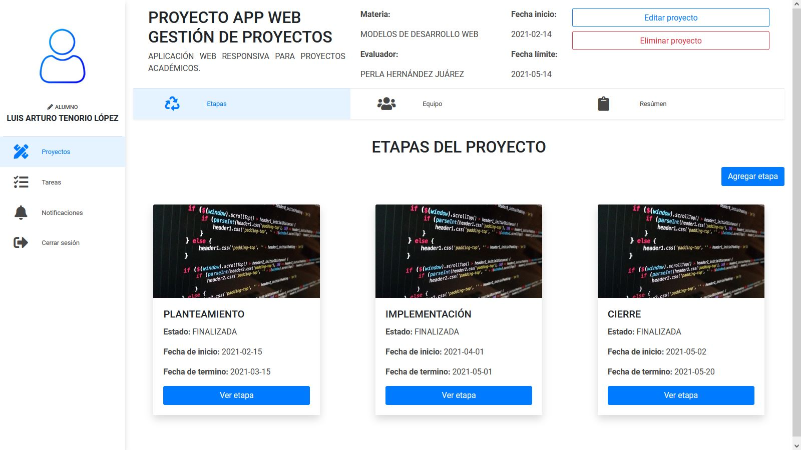

# MDW-PA-FrontEnd

Web development models - Academic Project Application (Front-end).

Live: https://mdw-pa-frontend.herokuapp.com/

Responsive web application to manage student projects.

As a student you can create projects to manage, invite classmates to collaborate, create project stages, view tasks assigned by the teacher, submit tasks, view reports on project progress.

As a teacher, you can view the classes you teach, the teams in each class, assign deliverables to the teams, download and grade the deliverables, and view a general project report.

**ACCESS DATA**

| Role    | User               | Password  |
| ------- | ------------------ | --------- |
| Student | arturo@alumno.com  | arturo123 |
| Teacher | perla@profesor.com | perla123  |

## Setup

An .env file is required to work; the required fields are the following: :

- NODE_ENV -> environment (production | development)
- HOST -> url of the web application server (localhost | ip_address)
- API_URL -> url of the api (localhost | ip_address)

## App screenshots

1. Application home screen, it is possible to enter as a student, teacher or create a new account.
   
   It is possible to register to create a student or teacher account, however, the account will not have any data as they must be registered in the database by an administrator.

2. Projects to which a student belongs..
   
   The student can view their projects or create a new one with the help of a form.

3. Project information..
   
   All the information regarding the selected project can be consulted: stages, members or summaries. It is also possible to create a new stage and add or remove members.

4. Deliverable information..
   
   Each stage of the project can have multiple deliverables (assigned by a teacher). It is possible to view basic information of the deliverable, send it, download rubrics or download it.
